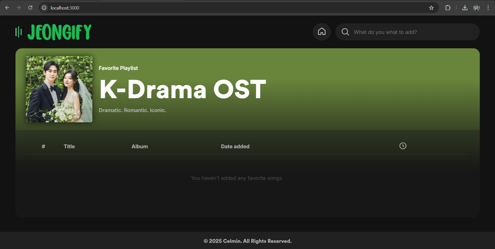
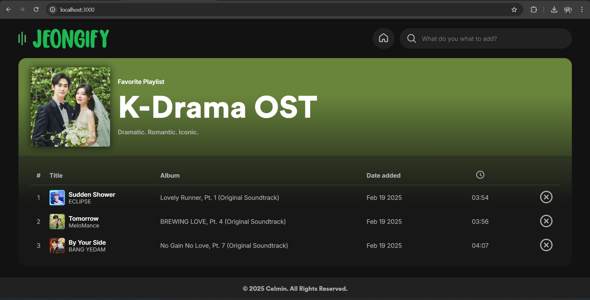
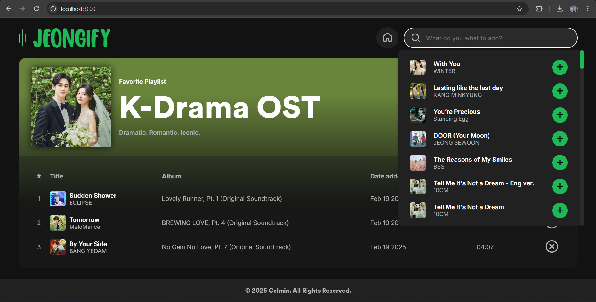

# ᯤ Jeongify :  A Simple Playlist Manager for Spotify
**Jeongify** is a playlist manager that allows users to search for songs in specific Spotify playlist and save or remove them in custom favorites playlist. The project utilizes the `Spotify API` for song retrieval and `PostgreSQL` for storing playlist data.

## ✨ Features
  - 🔍 **Search Songs** - Find songs from specific Spotify playlist.
  - 📌 **Save to Favorites** - Add songs to your custom playlist.
  - ❌ **Remove Songs** - Delete tracks from your favorites.
  - 📦 **Database Storage** - Store added and removed songs using PostgreSQL.

## </> Tech Stack
  - `Node.js`
  - `Express.js`
  - `Axios`
  - `EJS` (Embedded JavaScript)
  - `PostgreSQL`
  - `Spotify API`
 
## 💡 Get Started
### 1️⃣ Clone the Repository
```bash
https://github.com/clmnshn28/Jeongify.git
cd Jeongify
```
### 2️⃣ Install Dependencies
```bash
npm install
```
### 3️⃣ Set up environment variables
Create a .env file and add your Spotify API credentials and PostgreSQL database URL.
```bash
DB_USER = your_postgresql_username
DB_PASSWORD = your_postgresql_password
DB_NAME = your_postgresql_database_name
DB_HOST = your_postgresql_host_name

SPOTIFY_PLAYLIST_ID = your_playlist_id
SPOTIFY_CLIENT_ID = your_client_id
SPOTIFY_CLIENT_SECRET = your_client_secret
```
### 4️⃣ Run the Server
➤ Option 1: Run Normally
``` bash
node index.js
```
➤ Option 2: Use Nodemon for Auto-Restart on Changes
If you want the server to restart automatically when you make changes, install nodemon globally:
```bash
npm install -g nodemon
```
Then start the serve with:
```bash
nodemon index.js
```
"By default, The application will be running at *http://localhost:3000*. If you have a different port configured, update the .env file accordingly."

## 🔎 Overview





## 🤝 Contribution
Feel free to fork the repo and submit a pull request with improvements or additional features!

## 🪪 License
This project is open-source and available under the MIT License.

**💡 Let's build something awesome together! 🚀**


